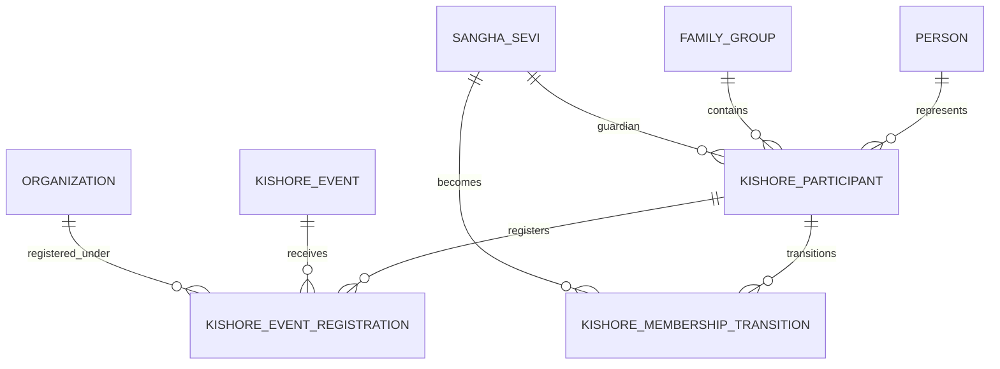

# NSS ERP Kishore Puja ERD

Document ID: SOL-KIS-002
Status: DRAFT

---

# 1. Core Entities

kishore_participant
kishore_event
kishore_event_registration
kishore_membership_transition

---

# 2. Logical ERD

---

# 3. Key Relationships

- Person to Kishore Participant (1 to 0..1)
- Kishore Participant to Event Registration (1 to many, one per year)
- Kishore Event to Event Registration (1 to many)
- Guardian (sangha_sevi) to Kishore Participant (mandatory)
- Kishore Participant to Membership Transition (1 to 0..1)

---

# 4. Identity Separation

Kishore ID (KH000123) is not equal to Sangha Sevi ID (SS000456).
Both remain preserved after transition.

---

# 5. Guardian Relationship

guardian_sangha_sevi_pk references sangha_sevi.
Guardian must be NSS Member of participant's Sakha.
Guardian is assigned by Sakha.

---

# 6. Sakha on Registration

Each annual registration preserves the Sakha for that year.
Historical Sakha association is never overwritten.

---

# 7. ERD Principles

- Kishore Participation is not NSS Membership
- Kishore ID is not Sangha Sevi ID
- Kishore Event Is Annual
- Registration Is Year/Event Specific
- Sakha Association Is Preserved
- Guardian Is an NSS Member
- History Is Preserved

---

# End of Document
