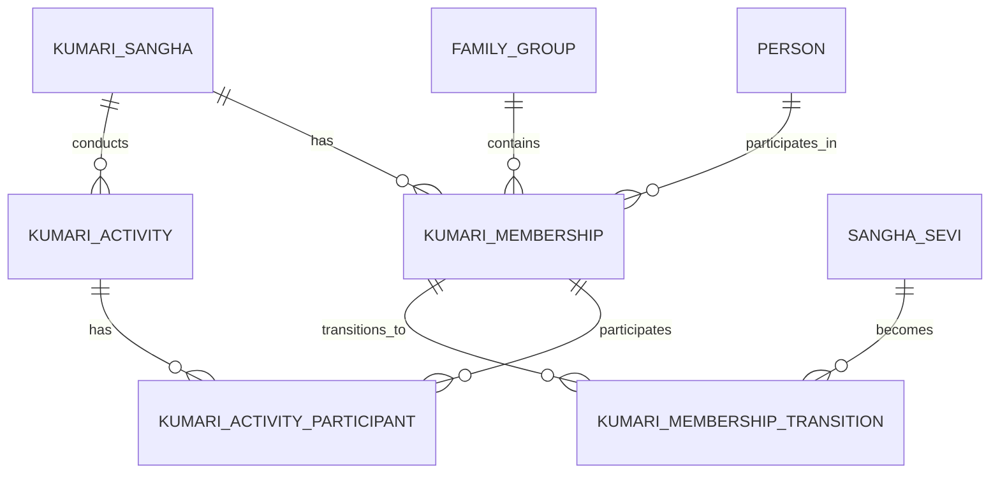

# NSS ERP Kumari Sangha ERD

Document ID: SOL-KUM-002
Status: DRAFT

---

# 1. Core Entities

kumari_sangha
kumari_membership
kumari_activity
kumari_activity_participant
kumari_membership_transition

---

# 2. Logical ERD

---

# 3. Key Relationships

- Person to Kumari Membership (1 to 0..1)
- Kumari Sangha to Kumari Membership (1 to many)
- Kumari Membership to Activity Participant (1 to many)
- Kumari Membership to Membership Transition (1 to 0..1)

---

# 4. Identity Separation

Kumari ID (KM000123) is not equal to Sangha Sevi ID (SS000456).
Both remain preserved after transition.

---

# 5. ERD Principles

- Kumari Participation is not NSS Membership
- Person Is Reused
- Family Is Reused
- Kumari History Is Preserved
- Membership Transition Is Explicit
- Module Ownership Is Preserved

---

# End of Document
