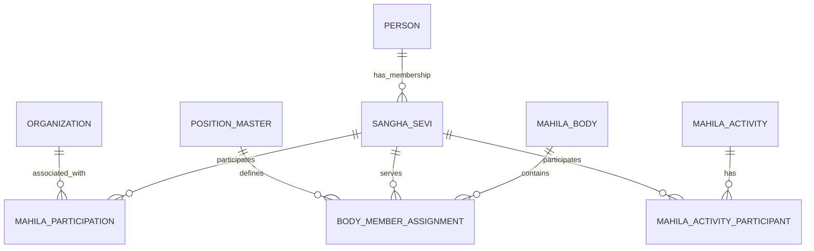

# NSS ERP Mahila Sangha ERD

Document ID: SOL-MAH-002
Status: DRAFT

---

# 1. Core Principle

Mahila Sangha does not create a separate Membership identity.
Person -> Sangha Sevi -> Mahila Sangha Participation.

---

# 2. Logical ERD

---

# 3. Common Tables Reused

person, family_group, family_relationship, sangha_sevi, organization, body_master, body_member_assignment, position_master

---

# 4. Module-Specific Entities

mahila_participation, mahila_activity, mahila_activity_participant

---

# 5. Governance Body Type

MAHILA_PARICHALANA_MANDALI — configured in body_master.

---

# 6. Data Ownership

| Data | Owner |
|------|-------|
| Person | Person Module |
| Family | Family Module |
| Membership | Membership Module |
| Sakha | Organization Module |
| Governance Body | Governance Module |
| Position | Governance Module |
| Mahila Participation | Mahila Module |
| Mahila Activity | Mahila Module |

---

# 7. ERD Principles

- Mahila Sangha Is an NSS Institution
- Membership Is Shared
- Governance Is Shared
- Organization Is Shared
- Person Is Shared
- Family Is Shared
- Mahila Participation Is Module-Specific
- History Is Preserved

---

# End of Document
