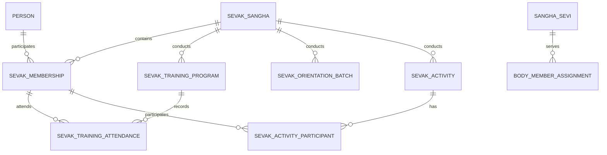

# NSS ERP Sevak Sangha ERD

Document ID: SOL-SEV-002
Status: PARTIALLY FROZEN

---

# 1. Proposed Core Tables

sevak_sangha
sevak_membership
sevak_training_program
sevak_training_attendance
sevak_orientation_batch
sevak_activity
sevak_activity_participant

Subject to final operational validation.

---

# 2. Logical ERD

---

# 3. Common Tables Reused

person, family_group, sangha_sevi, organization, body_master, body_member_assignment, position_master

---

# 4. Key Relationships

- Person to Sevak Membership (participation, not NSS Membership)
- Sevak Sangha to Training Programs (1 to many)
- Sevak Sangha to Activities (1 to many)
- Governance via common body_member_assignment

---

# 5. Data Ownership

| Data | Owner |
|------|-------|
| Person | Person Module |
| Family | Family Module |
| NSS Membership | Membership Module |
| Sevak Participation | Sevak Module |
| Training | Sevak Module |
| Service Activity | Sevak Module |
| Governance | Governance Module |
| UPBS Volunteer | UPBS Module |

---

# 6. ERD Status

Foundation: APPROVED
Operational Design: PARTIALLY FROZEN

---

# End of Document
